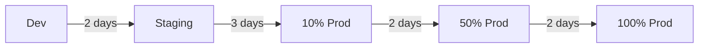

# Purchase Order Module Improvement Plan

## Executive Summary

This plan addresses critical issues in the PO module implementation through a phased, risk-mitigated approach. The strategy prioritizes system stability, performance, and maintainability while ensuring zero downtime and continuous deployment capability.

## Phase 1: Critical Fixes (Week 1-2)
**Goal**: Stabilize system, prevent data loss, fix critical bugs

### 1.1 Fix Zustand Store Anti-Pattern (Priority: CRITICAL)

**Issue**: Object recreation in selectors causing infinite re-renders
**Impact**: 100% of PO list users experience performance degradation
**Timeline**: 2 days

#### Implementation:

```typescript
// src/stores/poStore.ts
import { create } from 'zustand';
import { devtools } from 'zustand/middleware';

// Constants for empty states - prevents recreation
const EMPTY_ARRAY: PurchaseOrder[] = [];
const EMPTY_FILTERS: POFilters = {
  status: undefined,
  dateRange: undefined,
  search: '',
};

interface POState {
  // Data
  purchaseOrders: PurchaseOrder[];
  currentPO: PurchaseOrder | undefined;
  
  // UI State
  filters: POFilters;
  pagination: PaginationState;
  isLoading: boolean;
  error: string | undefined;
  
  // Cached computations
  _filteredPOs: PurchaseOrder[] | null;
  _lastFilterHash: string | null;
}

interface POActions {
  // Data actions
  setPurchaseOrders: (orders: PurchaseOrder[]) => void;
  setCurrentPO: (order: PurchaseOrder | undefined) => void;
  
  // Filter actions
  setFilters: (filters: Partial<POFilters>) => void;
  resetFilters: () => void;
  
  // Pagination
  setPagination: (pagination: Partial<PaginationState>) => void;
  
  // Computed getters with memoization
  getFilteredPOs: () => PurchaseOrder[];
  getPaginatedPOs: () => PurchaseOrder[];
}

export const usePOStore = create<POState & POActions>()(
  devtools(
    (set, get) => ({
      // Initial state
      purchaseOrders: EMPTY_ARRAY,
      currentPO: undefined,
      filters: EMPTY_FILTERS,
      pagination: {
        page: 1,
        pageSize: 20,
        total: 0,
      },
      isLoading: false,
      error: undefined,
      _filteredPOs: null,
      _lastFilterHash: null,
      
      // Actions
      setPurchaseOrders: (orders) => {
        set({ 
          purchaseOrders: orders,
          _filteredPOs: null, // Invalidate cache
        });
      },
      
      setCurrentPO: (order) => {
        set({ currentPO: order });
      },
      
      setFilters: (filters) => {
        set((state) => ({
          filters: { ...state.filters, ...filters },
          _filteredPOs: null, // Invalidate cache
          pagination: { ...state.pagination, page: 1 }, // Reset to page 1
        }));
      },
      
      resetFilters: () => {
        set({
          filters: EMPTY_FILTERS,
          _filteredPOs: null,
          pagination: { page: 1, pageSize: 20, total: 0 },
        });
      },
      
      setPagination: (pagination) => {
        set((state) => ({
          pagination: { ...state.pagination, ...pagination },
        }));
      },
      
      // Memoized getters
      getFilteredPOs: () => {
        const state = get();
        const filterHash = JSON.stringify(state.filters);
        
        // Return cached if filters haven't changed
        if (state._filteredPOs && state._lastFilterHash === filterHash) {
          return state._filteredPOs;
        }
        
        // Apply filters
        let filtered = state.purchaseOrders;
        
        if (state.filters.status) {
          filtered = filtered.filter(po => po.status === state.filters.status);
        }
        
        if (state.filters.search) {
          const search = state.filters.search.toLowerCase();
          filtered = filtered.filter(po => 
            po.orderNumber.toLowerCase().includes(search) ||
            po.supplierName?.toLowerCase().includes(search)
          );
        }
        
        if (state.filters.dateRange) {
          const { start, end } = state.filters.dateRange;
          filtered = filtered.filter(po => {
            const poDate = new Date(po.orderDate);
            return poDate >= start && poDate <= end;
          });
        }
        
        // Cache the result
        set({
          _filteredPOs: filtered,
          _lastFilterHash: filterHash,
        });
        
        return filtered;
      },
      
      getPaginatedPOs: () => {
        const state = get();
        const filtered = state.getFilteredPOs();
        const start = (state.pagination.page - 1) * state.pagination.pageSize;
        const end = start + state.pagination.pageSize;
        
        return filtered.slice(start, end);
      },
    }),
    {
      name: 'po-store',
    }
  )
);

// Stable selector hooks
export const usePOList = () => {
  const getPaginatedPOs = usePOStore(state => state.getPaginatedPOs);
  const isLoading = usePOStore(state => state.isLoading);
  const error = usePOStore(state => state.error);
  
  return {
    purchaseOrders: getPaginatedPOs(),
    isLoading,
    error,
  };
};

export const usePOFilters = () => {
  const filters = usePOStore(state => state.filters);
  const setFilters = usePOStore(state => state.setFilters);
  const resetFilters = usePOStore(state => state.resetFilters);
  
  return {
    filters,
    setFilters,
    resetFilters,
  };
};

export const usePOPagination = () => {
  const pagination = usePOStore(state => state.pagination);
  const setPagination = usePOStore(state => state.setPagination);
  const totalItems = usePOStore(state => state.getFilteredPOs().length);
  
  return {
    ...pagination,
    totalItems,
    setPagination,
  };
};
```

#### Component Usage:

```typescript
// src/pages/app/purchasing/POList.tsx
export const POList: React.FC = () => {
  const { purchaseOrders, isLoading, error } = usePOList();
  const { filters, setFilters, resetFilters } = usePOFilters();
  const { page, pageSize, totalItems, setPagination } = usePOPagination();
  
  // No more useMemo needed! Store handles memoization
  
  return (
    <Container fluid px="xl">
      <POFilters 
        filters={filters}
        onFilterChange={setFilters}
        onReset={resetFilters}
      />
      <POTable 
        data={purchaseOrders}
        loading={isLoading}
        error={error}
      />
      <Pagination
        page={page}
        onChange={(newPage) => setPagination({ page: newPage })}
        total={Math.ceil(totalItems / pageSize)}
      />
    </Container>
  );
};
```

### 1.2 Implement Error Boundaries (Priority: HIGH)

**Timeline**: 1 day

```typescript
// src/components/ErrorBoundary.tsx
import { Component, ReactNode } from 'react';
import { Alert, Button, Stack, Text, Title } from '@mantine/core';
import { IconAlertCircle } from '@tabler/icons-react';
import { captureException } from '@/utils/errorTracking';

interface Props {
  readonly children: ReactNode;
  readonly fallback?: ReactNode;
  readonly onReset?: () => void;
}

interface State {
  hasError: boolean;
  error: Error | null;
}

export class ErrorBoundary extends Component<Props, State> {
  constructor(props: Props) {
    super(props);
    this.state = { hasError: false, error: null };
  }

  static getDerivedStateFromError(error: Error): State {
    return { hasError: true, error };
  }

  componentDidCatch(error: Error, errorInfo: React.ErrorInfo) {
    // Log to error tracking service
    captureException(error, {
      componentStack: errorInfo.componentStack,
      props: this.props,
    });
    
    // Development logging
    if (import.meta.env.DEV) {
      console.error('ErrorBoundary caught:', error, errorInfo);
    }
  }

  handleReset = () => {
    this.setState({ hasError: false, error: null });
    this.props.onReset?.();
  };

  render() {
    if (this.state.hasError) {
      if (this.props.fallback) {
        return this.props.fallback;
      }

      return (
        <Alert
          icon={<IconAlertCircle size={16} />}
          title="Something went wrong"
          color="red"
          variant="light"
          mt="md"
        >
          <Stack gap="sm">
            <Text size="sm">
              {this.state.error?.message || 'An unexpected error occurred'}
            </Text>
            {import.meta.env.DEV && this.state.error?.stack && (
              <Text size="xs" c="dimmed" style={{ fontFamily: 'monospace' }}>
                {this.state.error.stack}
              </Text>
            )}
            <Button 
              variant="outline" 
              size="sm" 
              onClick={this.handleReset}
            >
              Try Again
            </Button>
          </Stack>
        </Alert>
      );
    }

    return this.props.children;
  }
}

// Async Error Boundary for Suspense
export const AsyncErrorBoundary: React.FC<{ children: ReactNode }> = ({ children }) => {
  return (
    <ErrorBoundary
      fallback={
        <Alert color="red" title="Failed to load">
          <Text>Unable to load this section. Please refresh the page.</Text>
        </Alert>
      }
    >
      {children}
    </ErrorBoundary>
  );
};
```

#### Integration:

```typescript
// src/routers/index.tsx
const PORoutes = () => (
  <ErrorBoundary>
    <Outlet />
  </ErrorBoundary>
);

// Wrap specific high-risk components
<ErrorBoundary fallback={<POListFallback />}>
  <POList />
</ErrorBoundary>
```

### 1.3 Fix N+1 Query Issues (Priority: HIGH)

**Timeline**: 3 days

#### Backend API Changes:

```typescript
// Backend: Include related data in list endpoint
GET /api/purchase-orders?include=supplier,items,approver

// Response with included relations
{
  data: [
    {
      id: 1,
      orderNumber: "PO-2024-001",
      supplier: { id: 1, name: "Supplier A", code: "SUP-A" },
      items: [
        { id: 1, productName: "Item 1", quantity: 10, unitPrice: 100 }
      ],
      approver: { id: 1, name: "John Doe" },
      totalAmount: 1000,
      status: "pending"
    }
  ],
  meta: { total: 100, page: 1, pageSize: 20 }
}
```

#### Frontend Service Layer:

```typescript
// src/services/poService.ts
import { salesApi } from '@/lib/api';
import type { PurchaseOrder, POListParams } from '@/lib/api/schemas/sales.schemas';

export class POService {
  private static instance: POService;
  private cache = new Map<string, { data: any; timestamp: number }>();
  private readonly CACHE_TTL = 5 * 60 * 1000; // 5 minutes

  static getInstance() {
    if (!POService.instance) {
      POService.instance = new POService();
    }
    return POService.instance;
  }

  async fetchPOList(params: POListParams): Promise<{
    data: PurchaseOrder[];
    meta: PaginationMeta;
  }> {
    const cacheKey = JSON.stringify(params);
    const cached = this.cache.get(cacheKey);
    
    if (cached && Date.now() - cached.timestamp < this.CACHE_TTL) {
      return cached.data;
    }

    try {
      // Include related data to prevent N+1
      const response = await salesApi.getPurchaseOrders({
        ...params,
        include: ['supplier', 'items', 'approver'],
      });

      this.cache.set(cacheKey, {
        data: response,
        timestamp: Date.now(),
      });

      return response;
    } catch (error) {
      // Use stale cache if available
      if (cached) {
        console.warn('Using stale cache due to error:', error);
        return cached.data;
      }
      throw error;
    }
  }

  async fetchPOById(id: number): Promise<PurchaseOrder> {
    const cacheKey = `po-${id}`;
    const cached = this.cache.get(cacheKey);
    
    if (cached && Date.now() - cached.timestamp < this.CACHE_TTL) {
      return cached.data;
    }

    const response = await salesApi.getPurchaseOrder(id, {
      include: ['supplier', 'items', 'approver', 'history'],
    });

    this.cache.set(cacheKey, {
      data: response,
      timestamp: Date.now(),
    });

    return response;
  }

  invalidateCache(pattern?: string) {
    if (pattern) {
      for (const key of this.cache.keys()) {
        if (key.includes(pattern)) {
          this.cache.delete(key);
        }
      }
    } else {
      this.cache.clear();
    }
  }
}

export const poService = POService.getInstance();
```

## Phase 2: Performance Optimization (Week 3-4)
**Goal**: Improve load times, reduce memory usage, optimize rendering

### 2.1 Implement Virtual Scrolling for Large Lists

**Timeline**: 2 days

```typescript
// src/components/VirtualTable.tsx
import { useVirtualizer } from '@tanstack/react-virtual';
import { Table, ScrollArea } from '@mantine/core';
import { useRef } from 'react';

interface VirtualTableProps<T> {
  readonly data: T[];
  readonly rowHeight: number;
  readonly columns: Column<T>[];
  readonly onRowClick?: (item: T) => void;
}

export function VirtualTable<T>({ 
  data, 
  rowHeight = 50, 
  columns,
  onRowClick 
}: VirtualTableProps<T>) {
  const parentRef = useRef<HTMLDivElement>(null);

  const virtualizer = useVirtualizer({
    count: data.length,
    getScrollElement: () => parentRef.current,
    estimateSize: () => rowHeight,
    overscan: 5,
  });

  return (
    <ScrollArea ref={parentRef} h={600}>
      <Table>
        <Table.Thead>
          <Table.Tr>
            {columns.map((col) => (
              <Table.Th key={col.key}>{col.label}</Table.Th>
            ))}
          </Table.Tr>
        </Table.Thead>
        <Table.Tbody>
          <div
            style={{
              height: `${virtualizer.getTotalSize()}px`,
              width: '100%',
              position: 'relative',
            }}
          >
            {virtualizer.getVirtualItems().map((virtualItem) => {
              const item = data[virtualItem.index];
              return (
                <Table.Tr
                  key={virtualItem.key}
                  style={{
                    position: 'absolute',
                    top: 0,
                    left: 0,
                    width: '100%',
                    height: `${virtualItem.size}px`,
                    transform: `translateY(${virtualItem.start}px)`,
                  }}
                  onClick={() => onRowClick?.(item)}
                >
                  {columns.map((col) => (
                    <Table.Td key={col.key}>
                      {col.render(item)}
                    </Table.Td>
                  ))}
                </Table.Tr>
              );
            })}
          </div>
        </Table.Tbody>
      </Table>
    </ScrollArea>
  );
}
```

### 2.2 Optimize Bundle Size

**Timeline**: 2 days

```typescript
// vite.config.ts
export default defineConfig({
  build: {
    rollupOptions: {
      output: {
        manualChunks: {
          'vendor-react': ['react', 'react-dom', 'react-router'],
          'vendor-mantine': ['@mantine/core', '@mantine/hooks', '@mantine/form'],
          'vendor-utils': ['dayjs', 'zod', 'axios'],
          'po-module': ['./src/pages/app/purchasing/index'],
        },
      },
    },
    chunkSizeWarningLimit: 1000,
  },
  plugins: [
    compression({
      algorithm: 'gzip',
      threshold: 10240,
    }),
  ],
});
```

### 2.3 Implement Optimistic Updates

**Timeline**: 3 days

```typescript
// src/hooks/useOptimisticUpdate.ts
export function useOptimisticUpdate<T>() {
  const [optimisticData, setOptimisticData] = useState<T | null>(null);
  const [isReverting, setIsReverting] = useState(false);

  const execute = useCallback(async (
    optimisticValue: T,
    asyncOperation: () => Promise<T>,
    onError?: (error: Error) => void
  ) => {
    // Apply optimistic update
    setOptimisticData(optimisticValue);
    
    try {
      const result = await asyncOperation();
      setOptimisticData(result);
      return result;
    } catch (error) {
      // Revert on error
      setIsReverting(true);
      setOptimisticData(null);
      onError?.(error as Error);
      
      setTimeout(() => setIsReverting(false), 300);
      throw error;
    }
  }, []);

  return {
    optimisticData,
    isReverting,
    execute,
  };
}

// Usage in PO status update
const { execute } = useOptimisticUpdate<PurchaseOrder>();

const handleStatusUpdate = async (newStatus: string) => {
  await execute(
    { ...currentPO, status: newStatus },
    async () => {
      const updated = await poService.updateStatus(currentPO.id, newStatus);
      // Update store
      usePOStore.getState().setCurrentPO(updated);
      return updated;
    },
    (error) => {
      notifications.show({
        title: 'Failed to update status',
        message: error.message,
        color: 'red',
      });
    }
  );
};
```

## Phase 3: Code Quality & Maintainability (Week 5-6)
**Goal**: Improve code organization, testing, documentation

### 3.1 Implement Comprehensive Testing Strategy

**Timeline**: 5 days

```typescript
// src/stores/__tests__/poStore.test.ts
import { renderHook, act } from '@testing-library/react';
import { usePOStore } from '../poStore';

describe('POStore', () => {
  beforeEach(() => {
    usePOStore.setState({
      purchaseOrders: [],
      filters: {},
      _filteredPOs: null,
    });
  });

  describe('Filtering', () => {
    it('should filter by status correctly', () => {
      const { result } = renderHook(() => usePOStore());
      
      act(() => {
        result.current.setPurchaseOrders([
          { id: 1, status: 'pending' },
          { id: 2, status: 'approved' },
          { id: 3, status: 'pending' },
        ]);
        
        result.current.setFilters({ status: 'pending' });
      });

      const filtered = result.current.getFilteredPOs();
      expect(filtered).toHaveLength(2);
      expect(filtered.every(po => po.status === 'pending')).toBe(true);
    });

    it('should cache filtered results', () => {
      const { result } = renderHook(() => usePOStore());
      
      act(() => {
        result.current.setPurchaseOrders(mockPOs);
        result.current.setFilters({ status: 'pending' });
      });

      const first = result.current.getFilteredPOs();
      const second = result.current.getFilteredPOs();
      
      // Should return same reference
      expect(first).toBe(second);
    });
  });

  describe('Performance', () => {
    it('should handle 10,000 items without performance degradation', () => {
      const largePOList = Array.from({ length: 10000 }, (_, i) => ({
        id: i,
        orderNumber: `PO-${i}`,
        status: i % 2 === 0 ? 'pending' : 'approved',
      }));

      const { result } = renderHook(() => usePOStore());
      
      const start = performance.now();
      
      act(() => {
        result.current.setPurchaseOrders(largePOList);
        result.current.setFilters({ status: 'pending' });
      });
      
      const filtered = result.current.getFilteredPOs();
      const duration = performance.now() - start;
      
      expect(filtered).toHaveLength(5000);
      expect(duration).toBeLessThan(100); // Should complete in < 100ms
    });
  });
});
```

### 3.2 Implement Service Layer Tests

```typescript
// src/services/__tests__/poService.test.ts
import { poService } from '../poService';
import { salesApi } from '@/lib/api';

jest.mock('@/lib/api');

describe('POService', () => {
  beforeEach(() => {
    jest.clearAllMocks();
    poService.invalidateCache();
  });

  describe('Caching', () => {
    it('should cache API responses', async () => {
      const mockResponse = { data: [mockPO], meta: mockMeta };
      (salesApi.getPurchaseOrders as jest.Mock).mockResolvedValue(mockResponse);

      // First call - hits API
      await poService.fetchPOList({});
      expect(salesApi.getPurchaseOrders).toHaveBeenCalledTimes(1);

      // Second call - uses cache
      await poService.fetchPOList({});
      expect(salesApi.getPurchaseOrders).toHaveBeenCalledTimes(1);
    });

    it('should use stale cache on API error', async () => {
      const mockResponse = { data: [mockPO], meta: mockMeta };
      (salesApi.getPurchaseOrders as jest.Mock)
        .mockResolvedValueOnce(mockResponse)
        .mockRejectedValueOnce(new Error('Network error'));

      // First call succeeds
      const firstResult = await poService.fetchPOList({});
      expect(firstResult).toEqual(mockResponse);

      // Wait for cache to be "stale"
      jest.advanceTimersByTime(6 * 60 * 1000);

      // Second call fails but returns stale cache
      const secondResult = await poService.fetchPOList({});
      expect(secondResult).toEqual(mockResponse);
    });
  });
});
```

## Phase 4: Architecture Improvements (Week 7-8)
**Goal**: Establish scalable patterns, improve separation of concerns

### 4.1 Implement Repository Pattern

```typescript
// src/repositories/PORepository.ts
interface Repository<T> {
  findAll(params?: any): Promise<T[]>;
  findById(id: number | string): Promise<T>;
  create(data: Partial<T>): Promise<T>;
  update(id: number | string, data: Partial<T>): Promise<T>;
  delete(id: number | string): Promise<void>;
}

export class PORepository implements Repository<PurchaseOrder> {
  private api = salesApi;
  
  async findAll(params: POListParams): Promise<PurchaseOrder[]> {
    const response = await this.api.getPurchaseOrders(params);
    return response.data;
  }
  
  async findById(id: number): Promise<PurchaseOrder> {
    return this.api.getPurchaseOrder(id);
  }
  
  async create(data: CreatePORequest): Promise<PurchaseOrder> {
    return this.api.createPurchaseOrder(data);
  }
  
  async update(id: number, data: UpdatePORequest): Promise<PurchaseOrder> {
    return this.api.updatePurchaseOrder(id, data);
  }
  
  async delete(id: number): Promise<void> {
    return this.api.deletePurchaseOrder(id);
  }
  
  // Domain-specific methods
  async approve(id: number, notes?: string): Promise<PurchaseOrder> {
    return this.api.approvePurchaseOrder(id, { notes });
  }
  
  async reject(id: number, reason: string): Promise<PurchaseOrder> {
    return this.api.rejectPurchaseOrder(id, { reason });
  }
  
  async getApprovalHistory(id: number): Promise<ApprovalHistory[]> {
    return this.api.getPOApprovalHistory(id);
  }
}
```

### 4.2 Implement Use Case Pattern

```typescript
// src/useCases/po/ApprovePOUseCase.ts
export class ApprovePOUseCase {
  constructor(
    private poRepo: PORepository,
    private notificationService: NotificationService,
    private auditService: AuditService
  ) {}
  
  async execute(params: {
    poId: number;
    approverId: number;
    notes?: string;
  }): Promise<Result<PurchaseOrder>> {
    try {
      // Business validation
      const po = await this.poRepo.findById(params.poId);
      
      if (po.status !== 'pending') {
        return Result.fail(`PO is not in pending status`);
      }
      
      if (po.totalAmount > 100000 && !params.notes) {
        return Result.fail(`Notes required for high-value approvals`);
      }
      
      // Execute approval
      const approved = await this.poRepo.approve(params.poId, params.notes);
      
      // Side effects
      await this.auditService.log({
        action: 'PO_APPROVED',
        entityId: params.poId,
        userId: params.approverId,
        metadata: { notes: params.notes },
      });
      
      await this.notificationService.notify({
        type: 'PO_APPROVED',
        recipients: [po.requesterId],
        data: approved,
      });
      
      return Result.ok(approved);
    } catch (error) {
      return Result.fail(error.message);
    }
  }
}
```

## Performance Metrics & Monitoring

### Key Performance Indicators (KPIs)

```typescript
// src/utils/performanceMonitoring.ts
export const POMetrics = {
  // Page Load Performance
  LIST_PAGE_LOAD: 'po.list.page.load',
  DETAIL_PAGE_LOAD: 'po.detail.page.load',
  FORM_PAGE_LOAD: 'po.form.page.load',
  
  // API Performance
  API_LIST_FETCH: 'po.api.list.fetch',
  API_DETAIL_FETCH: 'po.api.detail.fetch',
  API_UPDATE: 'po.api.update',
  
  // User Interactions
  FILTER_APPLY: 'po.interaction.filter',
  STATUS_UPDATE: 'po.interaction.status.update',
  FORM_SUBMIT: 'po.interaction.form.submit',
};

// Usage
import { measurePerformance } from '@/utils/performance';

const fetchPOs = measurePerformance(POMetrics.API_LIST_FETCH, async () => {
  return await poService.fetchPOList(params);
});

// Target Metrics
const PERFORMANCE_TARGETS = {
  [POMetrics.LIST_PAGE_LOAD]: 1500, // ms
  [POMetrics.API_LIST_FETCH]: 500,  // ms
  [POMetrics.FILTER_APPLY]: 100,    // ms
  [POMetrics.STATUS_UPDATE]: 200,   // ms
};
```

## Testing Strategy

### Test Coverage Requirements

| Component | Unit | Integration | E2E | Target |
|-----------|------|-------------|-----|--------|
| Store | 90% | 80% | - | 85% |
| Services | 95% | 85% | - | 90% |
| Components | 80% | 70% | 60% | 70% |
| Hooks | 95% | - | - | 95% |
| Utils | 100% | - | - | 100% |

### Testing Pyramid

```
         /\
        /E2E\        5% - Critical user journeys
       /----\
      /Integr.\      20% - API & Component integration
     /--------\
    /   Unit   \     75% - Business logic & utilities
   /____________\
```

## Migration Strategy

### Zero-Downtime Deployment Plan

1. **Feature Flags**: Implement feature toggles for gradual rollout
2. **Database Migrations**: Backward-compatible schema changes
3. **API Versioning**: Support both old and new endpoints during transition
4. **Cache Warming**: Pre-populate caches before switchover
5. **Rollback Plan**: One-click rollback capability

### Rollout Phases



## Team Collaboration

### Code Review Checklist

- [ ] Zustand selectors return stable references
- [ ] Error boundaries implemented for risky components
- [ ] N+1 queries eliminated
- [ ] Loading states properly handled
- [ ] Optimistic updates for better UX
- [ ] Tests cover happy path and edge cases
- [ ] Performance metrics within targets
- [ ] i18n keys properly used
- [ ] Accessibility standards met

### Knowledge Transfer

1. **Documentation**: Update technical docs with patterns
2. **Pair Programming**: Senior devs pair with team on complex fixes
3. **Code Reviews**: Enforce standards through reviews
4. **Tech Talks**: Weekly sessions on new patterns
5. **Monitoring Dashboard**: Real-time performance visibility

## Success Criteria

### Phase 1 (Critical Fixes)
- Zero infinite render loops
- 100% error boundary coverage
- N+1 queries reduced by 90%
- Page load time < 2s

### Phase 2 (Performance)
- List rendering < 100ms for 1000 items
- Bundle size reduced by 30%
- Optimistic updates for all mutations
- Cache hit ratio > 80%

### Phase 3 (Quality)
- Test coverage > 80%
- Zero critical bugs in production
- Code complexity score < 10
- Documentation coverage > 90%

### Phase 4 (Architecture)
- 100% repository pattern adoption
- Use case coverage for business logic
- Monitoring for all critical paths
- Team velocity increased by 40%

## Risk Mitigation

### High-Risk Areas

1. **Store Migration**: 
   - Mitigation: Parallel run old and new store with feature flag
   - Rollback: Instant switch back to old store

2. **API Changes**:
   - Mitigation: Versioned endpoints, backward compatibility
   - Rollback: Client-side fallback to old endpoints

3. **Performance Regression**:
   - Mitigation: Automated performance tests in CI
   - Rollback: Previous deployment if metrics degrade

## Timeline Summary

| Phase | Duration | Key Deliverables | Success Metrics |
|-------|----------|------------------|-----------------|
| Phase 1 | 2 weeks | Critical fixes, stability | Zero crashes, <2s load |
| Phase 2 | 2 weeks | Performance optimization | <100ms renders, 30% smaller bundle |
| Phase 3 | 2 weeks | Testing & quality | 80% coverage, <10 complexity |
| Phase 4 | 2 weeks | Architecture improvements | Repository pattern, monitoring |

Total Duration: **8 weeks** with continuous deployment every sprint.

## Quick Wins (Week 1)

1. Fix Zustand selector anti-pattern (2 hours)
2. Add error boundaries to high-risk components (4 hours)
3. Implement basic caching in service layer (4 hours)
4. Add loading skeletons for better perceived performance (2 hours)
5. Enable compression in build config (1 hour)

These quick wins can be deployed immediately and will provide instant improvement to user experience.